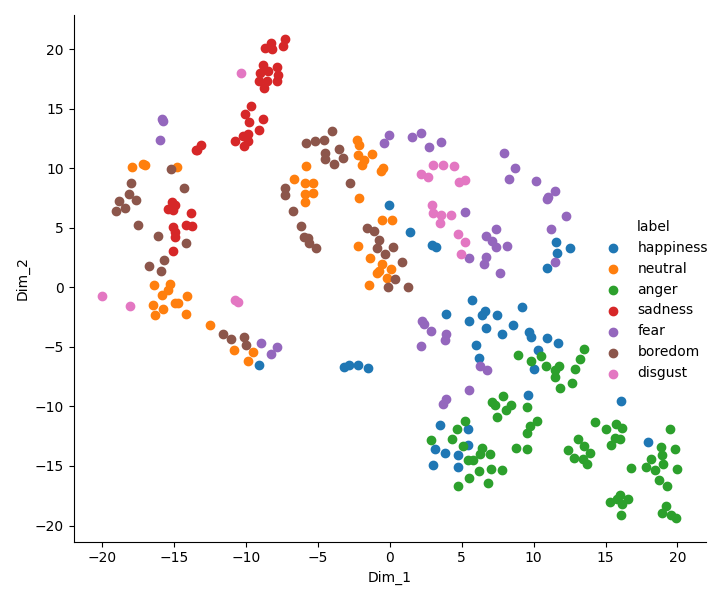

# Maschinelle Sprachverarbeitung

## Name of students:
* (max. 3)
*
*

## Exercise 1: Classification

* install [nkululeko](https://github.com/felixbur/nkululeko/)
* download two emotional databases (A and B), link in seminar
* create an nkululeko ini file for each

### Question: 
* what kind of classifiers do you know? 
* in short: list them, describe them, compare them

your answer:

### Task 1: 
* for each of the two databases:
  * for three different classifiers and at least two feature_sets, do nkululeko experiments
  
### Question:
* present and interpret your results

your answer:

### Task 2: 
* train a model on database A and use this to predict database B
* Again, try several feature sets and classifiers

### Question:
* present and interpret your results

your answer:

## Tips
* Present the confusion matrices and similar plots in your report
* This, for example, is a t-SNE plot of the TRILL features for EmoDB

